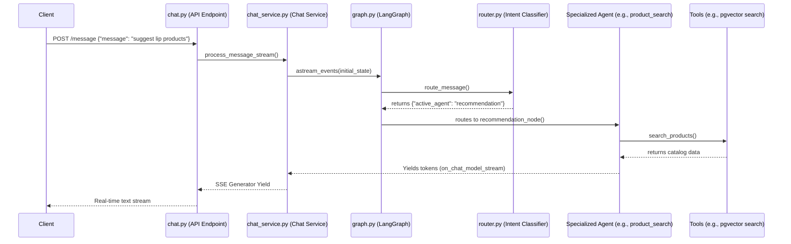
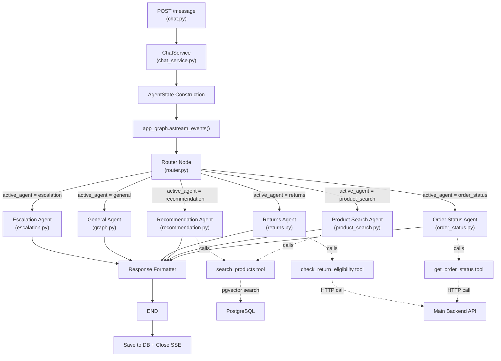

# AI Assistant Request Flow Architecture

This document provides a comprehensive end-to-end walkthrough of exactly what happens when a user sends a message to the AI assistant. It traces the lifecycle of a request from the initial HTTP hit to the final streaming response.

---

## High-Level Flow Diagram



---

## Step-by-Step Walkthrough

### Step 1 — The HTTP Request Hits the Endpoint

**File:** `ai-assistant/app/api/v1/endpoints/chat.py`

When the frontend sends a message, it arrives at the `@router.post("/message")` endpoint.

```python
@router.post("/message")
async def send_message(
    request: ChatMessageRequest, db: AsyncSession = Depends(get_db)
) -> EventSourceResponse:
    chat_service = ChatService(db)
    return EventSourceResponse(
        chat_service.process_message_stream(request.message, request.conversation_id)
    )
```

What happens here:

1. **Request Validation**: FastAPI validates the incoming JSON body against `ChatMessageRequest` (Pydantic schema). This ensures the `message` field exists and is valid.
2. **Database Injection**: FastAPI's dependency injection provides the PostgreSQL async session (`db: AsyncSession`) via `Depends(get_db)`.
3. **Service Instantiation**: The `ChatService` is created with the database session.
4. **Streaming Setup**: Instead of waiting for a complete response, the endpoint wraps the `process_message_stream()` async generator inside an `EventSourceResponse`. This is what enables **Server-Sent Events (SSE)** — the browser receives tokens as they are generated, creating the real-time "typing" effect and meeting the **< 1.5s Time-to-First-Token (TTFT)** requirement from the BRD.

> **Key Insight**: The endpoint does NOT `await` the full response. It returns a *streaming generator*, and the HTTP connection stays open while tokens are pushed to the client one by one.

---

### Step 2 — Context Preparation and Persistence

**File:** `ai-assistant/app/services/chat_service.py`

Before the AI sees the message, the `ChatService` must establish the conversational context.

#### 2a. Conversation Management

```python
conversation = await self.get_or_create_conversation(conversation_id)
```

- If the client sends a `conversation_id`, the service looks it up in the database.
- If it doesn't exist (or is `None`), a new `Conversation` record is created.
- This allows multi-turn conversations — the AI remembers what was said earlier.

#### 2b. Save the User's Message

```python
user_msg = Message(conversation_id=conversation.id, role="user", content=message)
self.db.add(user_msg)
await self.db.commit()
```

The user's raw message is immediately persisted to the `Message` table in PostgreSQL. This ensures we never lose a message, even if the AI processing fails later.

#### 2c. Load Conversation History

```python
result = await self.db.execute(
    select(Message)
    .where(Message.conversation_id == conversation.id)
    .order_by(Message.created_at)
)
db_messages = result.scalars().all()
```

All previous messages in this conversation are loaded from the database, ordered chronologically. This gives the AI the full context of the conversation.

#### 2d. Translate to LangChain Primitives

```python
for m in db_messages:
    if m.role == "user":
        lc_messages.append(HumanMessage(content=m.content))
    elif m.role == "assistant":
        lc_messages.append(AIMessage(content=m.content))
```

Database records are converted into LangChain message objects (`HumanMessage`, `AIMessage`). These are the format that LangGraph and the LLM understand.

#### 2e. Build the Initial State

```python
initial_state = AgentState(
    messages=lc_messages, active_agent=None, context=None, escalate=False
)
```

An `AgentState` TypedDict is created. This is the **lifeblood of LangGraph** — it gets passed from node to node throughout the entire execution. At this point:
- `messages`: The full conversation history.
- `active_agent`: `None` (the router hasn't decided yet).
- `context`: `None` (no tool results yet).
- `escalate`: `False` (no escalation triggered).

---

### Step 3 — Entering the LangGraph State Machine

**File:** `ai-assistant/app/agent/graph.py`

The Chat Service kicks off the AI logic:

```python
async for event in app_graph.astream_events(initial_state, version="v2"):
```

- `app_graph` is a compiled `StateGraph` — a state machine built at module load time by the `build_graph()` function.
- `astream_events()` starts the graph execution and yields **fine-grained events** for everything that happens inside — including individual LLM tokens, tool calls, and node transitions.
- LangGraph sees `workflow.set_entry_point("router")` and begins execution at the **Router** node.

> **Why `astream_events` instead of `astream`?**
> `astream()` only yields results when an entire node finishes. `astream_events()` yields events for every internal operation — including individual tokens from nested sub-agents. This is critical for real-time streaming.

---

### Step 4 — Intent Classification (The Router)

**File:** `ai-assistant/app/agent/nodes/router.py`

The router is a lightweight, zero-temperature LLM call. Its only job is to classify the user's intent.

```python
async def route_message(state: AgentState) -> dict:
    model = get_chat_model(temperature=0.0)
    messages = [SystemMessage(content=ROUTER_SYSTEM_PROMPT)] + state["messages"][-1:]
    response = await model.ainvoke(messages)
    decision = response.content.strip().lower()
    return {"active_agent": decision}
```

What happens:

1. A `ChatGroq` model is instantiated with `temperature=0.0` (fully deterministic).
2. It receives a system prompt listing available agents:
   - `"order_status"` — order tracking and delivery inquiries
   - `"product_search"` — finding and comparing products
   - `"recommendation"` — suggesting related/complementary products
   - `"returns"` — return eligibility checking
   - `"general"` — generic greetings and fallback
3. It analyzes only the **latest** user message (`state["messages"][-1:]`).
4. It outputs a single string (e.g., `"recommendation"`).
5. This string is written to `state["active_agent"]`.

> **Example**: For the message *"suggest some lip products for dry lips"*, the router outputs `"recommendation"`.

---

### Step 5 — Conditional Routing ("The Traffic Cop")

**File:** `ai-assistant/app/agent/graph.py`

After the router node finishes, LangGraph evaluates the conditional edges:

```python
workflow.add_conditional_edges(
    "router",
    lambda state: state["active_agent"],
    {
        "order_status": "order_status",
        "product_search": "product_search",
        "returns": "returns",
        "recommendation": "recommendation",
        "escalation": "escalation",
        "general": "general",
    },
)
```

This is the traffic cop of the system:

1. LangGraph reads `state["active_agent"]` — which the router just set to `"recommendation"`.
2. It matches `"recommendation"` in the dictionary.
3. It routes execution to the `"recommendation"` node.

> **No agent function is ever called directly.** You never write `recommendation_node()` yourself. The graph navigates itself based on the router's decision and the conditional edge map.

---

### Step 6 — The Specialized Sub-Agent Takes Over

**Files:** `ai-assistant/app/agent/nodes/recommendation.py` (or `product_search.py`, `returns.py`, `order_status.py`)

The chosen node function executes. Here's what happens inside `recommendation_node`:

```python
async def recommendation_node(state: AgentState, config: RunnableConfig) -> dict:
    model = get_chat_model(temperature=0.0)
    tools = [search_products]

    agent = create_react_agent(model, tools, prompt=RECOMMENDATION_AGENT_SYSTEM_PROMPT)

    final_result = None
    async for chunk in agent.astream({"messages": state["messages"]}, config):
        final_result = chunk

    new_messages = final_result["messages"][len(state["messages"]):]
    return {"messages": new_messages}
```

What happens:

1. **Model**: A `ChatGroq` instance is created at `temperature=0.0` — ensuring the LLM sticks strictly to tool results and doesn't hallucinate.
2. **Tools**: The `search_products` tool is attached. This is the only way the agent can access your product catalog.
3. **React Agent**: `create_react_agent` builds a ReAct-pattern agent. This is a loop that:
   - **Reasons** about the user's request.
   - **Acts** by calling a tool (e.g., `search_products`).
   - **Observes** the tool's output.
   - **Repeats** if more information is needed.
   - **Responds** once it has enough data.
4. **Config Propagation**: The `config: RunnableConfig` is passed down from the parent graph. This is critical — without it, the sub-agent's token-streaming events would be invisible to the parent's `astream_events()` listener.
5. **System Prompt**: The `RECOMMENDATION_AGENT_SYSTEM_PROMPT` strictly instructs the agent to:
   - NEVER make up products, prices, or inventory levels.
   - Only suggest products returned by the search tool.

---

### Step 7 — Tool Execution (RAG Product Search)

**File:** `ai-assistant/app/agent/tools/product_tools.py`

When the sub-agent decides it needs product data, it calls the `search_products` tool:

```python
@tool
async def search_products(query: str, limit: int = 5) -> str:
    query_vector = await embedding_client.embed_query(query)
    async with AsyncSessionLocal() as session:
        repo = EmbeddingRepository(session)
        products = await repo.search_similar_products(query_vector, limit=limit)
    # Format and return product data
```

What happens:

1. **Embedding**: The query text (e.g., `"lip products for dry lips"`) is converted into a dense vector using the embedding client.
2. **Vector Search**: The vector is used to perform a **cosine similarity search** against the `ProductEmbedding` table in PostgreSQL (powered by the `pgvector` extension). This is a **Retrieval-Augmented Generation (RAG)** pattern.
3. **Formatting**: The matching products (with real names, prices, and stock levels from your catalog) are formatted into a structured string.
4. **Return**: The string is sent back to the sub-agent as the tool's output. The sub-agent now has **real, grounded data** to compose its response.

> **This is what prevents hallucination**: The agent can ONLY recommend products that exist in the database. It has no other source of product information.

---

### Step 8 — Token Streaming Back to the User

**File:** `ai-assistant/app/services/chat_service.py`

Armed with the tool's catalog data, the sub-agent begins composing the final user-facing answer. As the Groq LLM generates the response, it emits tokens one by one.

```python
async for event in app_graph.astream_events(initial_state, version="v2"):
    if event["event"] == "on_chat_model_stream":
        chunk = event["data"].get("chunk")
        if chunk and hasattr(chunk, "content") and chunk.content:
            token = chunk.content
            final_response_text += token
            yield json.dumps({
                "event_type": "token",
                "data": {"text": token},
                "conversation_id": str(conversation.id),
            })
```

What happens:

1. **Event Filtering**: `astream_events` emits many event types (`on_tool_start`, `on_tool_end`, `on_chat_model_start`, etc.). We only care about `"on_chat_model_stream"` — the event fired when the LLM produces a single token.
2. **Token Extraction**: Each event contains a `chunk` with a `.content` property — a small string like `"I"`, `" found"`, `" these"`, `" lip"`, `" balms"`.
3. **Accumulation**: The token is appended to `final_response_text` (for later persistence).
4. **SSE Yield**: The token is immediately `yield`ed as a JSON string. This is picked up by the `EventSourceResponse` in the API layer and pushed over the wire to the client.

> **This creates the real-time "typing" effect.** Even if the AI takes 5 seconds to write a full paragraph, the user sees the first word in under a second.

---

### Step 9 — Response Formatting

**File:** `ai-assistant/app/agent/nodes/response_formatter.py`

After the specialized agent finishes, LangGraph follows the edge defined in `graph.py`:

```python
workflow.add_edge("recommendation", "response_formatter")
```

The `response_formatter_node` receives the full state (including all new messages from the sub-agent) and applies any final formatting, tone adjustments, or structural cleanup before the response is finalized.

---

### Step 10 — Final Persistence

**File:** `ai-assistant/app/services/chat_service.py`

Once the `astream_events` loop completes (the graph has reached `END`), the full response is saved:

```python
assistant_msg = Message(
    conversation_id=conversation.id, role="assistant", content=final_response_text
)
self.db.add(assistant_msg)
await self.db.commit()
```

- The fully assembled response string is persisted to the `Message` table with `role="assistant"`.
- This ensures the next time the user sends a message, the AI has full context of what it previously said.
- The HTTP connection cleanly terminates.

---

## Component Architecture Summary



---

## Key Design Decisions

| Decision | Rationale |
|---|---|
| **SSE over WebSockets** | SSE is simpler, works over standard HTTP, and is sufficient for unidirectional token streaming. |
| **`astream_events` over `astream`** | Enables capturing tokens from deeply nested sub-agents, not just top-level node completions. |
| **`RunnableConfig` propagation** | Without passing `config` to inner agents, their streaming events are invisible to the parent graph's listener. |
| **`temperature=0.0` on all agents** | Eliminates creative hallucination. Agents strictly report what tools return. |
| **Router as a separate node** | Decouples intent classification from execution. The router is cheap and fast; specialized agents are heavier. |
| **RAG via pgvector** | Products are embedded and stored in PostgreSQL. Semantic search ensures only real catalog items are returned. |
| **Separate microservice** | The AI assistant runs independently from the main backend. It calls the main backend's APIs via HTTP when it needs order/return data. |
